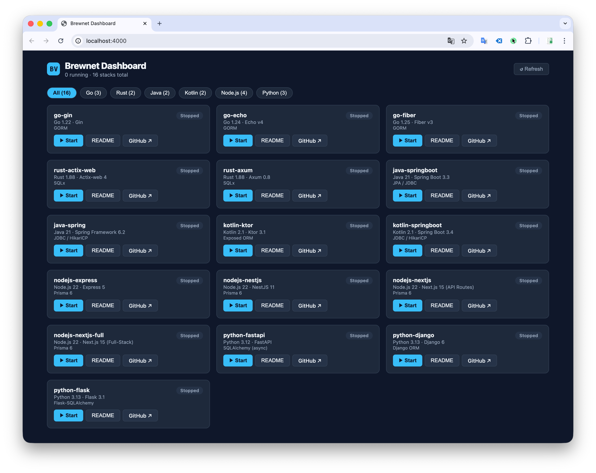

<p align="center">
  <h1 align="center">Brewnet Boilerplate</h1>
  <p align="center">
    <a href="https://www.brewnet.dev">https://www.brewnet.dev</a> · <a href="mailto:brewnet.dev@gmail.com">brewnet.dev@gmail.com</a>
  </p>
  <p align="center">
    <em>손쉽게 설치하는 나만의 홈서버, Brewnet</em><br/>
    <strong>Your server on tap. Just brew it.</strong><br/>
    <em>한 명령어로 풀스택 앱을 생성하세요.</em>
  </p>
</p>

<p align="center">
  <a href="./README.md">English README</a> ·
  <a href="#빠른-시작">빠른 시작</a> ·
  <a href="#지원-스택">스택</a> ·
  <a href="#cli-사용법">CLI 사용법</a> ·
  <a href="#수동-클론">수동 클론</a>
</p>

---

## Brewnet Boilerplate란?

이 저장소는 **[Brewnet](https://github.com/claude-code-expert/brewnet)** 의 공식 보일러플레이트 모음입니다. Brewnet은 Self-hosting을 위한 Home Server 솔루션으로, 집에 있는 Mac 또는 Linux 장비에서 홈페이지, API, E-Biz 서비스를 직접 서빙할 수 있도록 설계되었습니다.

**Brewnet CLI** (`brewnet create-app`)는 이 저장소에서 원하는 스택을 자동으로 clone하고, 보안 시크릿이 포함된 `.env`를 생성한 뒤 Docker로 풀스택 애플리케이션을 바로 실행합니다. 별도의 수동 설정이 필요 없습니다.

### Brewnet으로 만들 수 있는 것

- 집에 있는 장비에서 직접 서빙하는 개인 홈페이지 및 포트폴리오
- 자신의 Mac 또는 Linux 서버에서 운영하는 웹 서비스 및 E-Biz 플랫폼
- PostgreSQL, MySQL, SQLite3를 기반으로 6개 언어 × 16개 프레임워크 조합의 풀스택 앱

이 모노레포의 각 스택은 `docker compose up` 한 번으로 실행 가능한 독립적인 백엔드 + 프론트엔드 프로젝트입니다. 지원 언어: **Python, Node.js, Java, Kotlin, Rust, Go** — 각 언어별 다양한 프레임워크 옵션 제공.

> **Brewnet CLI** — 소스 코드 및 문서: [github.com/claude-code-expert/brewnet](https://github.com/claude-code-expert/brewnet)
> **라이브 데모**: [www.brewnet.dev](https://www.brewnet.dev)

## 사전 요구사항

스택을 실행하기 전에 아래 항목이 설치되어 있고 실행 중인지 확인하세요:

| 요구사항 | 버전 | 설치 |
|----------|------|------|
| **Docker Desktop** (macOS / Windows) 또는 **Docker Engine** (Linux) | 27+ | [docs.docker.com/get-docker](https://docs.docker.com/get-docker/) |
| **Docker Compose** (Docker Desktop에 포함) | v2+ | Docker Desktop에 포함 |
| **Node.js** (대시보드 전용) | 18+ | [nodejs.org](https://nodejs.org/) |

> ⚠️ **▶ Start 버튼** 클릭 또는 `make dev` 실행 전에 **Docker Desktop이 반드시 실행 중** 이어야 합니다.
> 각 스택은 `docker compose up -d --build` 명령으로 백엔드, 프론트엔드, DB를 Docker 컨테이너로 실행합니다.

```bash
# Docker 실행 확인
docker info
# "Cannot connect to the Docker daemon" 메시지가 나오면 → Docker Desktop을 먼저 실행하세요
```

---

## 빠른 시작

### 방법 1: Brewnet CLI (권장)

```bash
# Brewnet CLI 설치
npm install -g brewnet

# 새 프로젝트 생성
brewnet create-app my-project

# 대화형 프롬프트가 단계별로 안내합니다:
# → 언어 선택 (Go, Rust, Java, Kotlin, Node.js, Python)
# → 프레임워크 선택 (Gin, Echo, Fiber, Spring Boot, Express, FastAPI, ...)
# → 프론트엔드 선택 (React, API-only)
# → 보안 시크릿이 포함된 .env 자동 생성
# → Docker 컨테이너 시작

# 앱 열기
open http://localhost:3000
```

### 방법 2: 대시보드 (브라우저 UI)

```bash
git clone https://github.com/claude-code-expert/brewnet-boilerplate.git
cd brewnet-boilerplate/dashboard
npm install
npm run dev
# → http://localhost:4000
```

브라우저에서 **http://localhost:4000**을 열면 16개 스택 전체를 한눈에 확인하고 Start/Stop/테스트할 수 있습니다. 스택마다 터미널을 열 필요가 없습니다.

> ⚠️ 스택 카드의 **▶ Start** 버튼 클릭 전에 **Docker Desktop이 반드시 실행 중**이어야 합니다.

### 방법 3: 수동 클론

```bash
# 원하는 스택 브랜치를 직접 clone (권장)
git clone --depth=1 -b stack/go-gin \
  https://github.com/claude-code-expert/brewnet-boilerplate.git my-project
cd my-project
cp .env.example .env
make dev

open http://localhost:3000
```

---

## 지원 스택

16개의 백엔드 스택을 제공하며, 모두 Docker로 프로덕션 준비가 되어 있습니다. 각 스택에는 React 19 + Vite 6 + TypeScript가 기본 프론트엔드로 포함되어 있습니다.

### 백엔드 스택

| 언어 | 스택 | 프레임워크 | ORM / DB 레이어 | 진입점 |
|------|------|------------|-----------------|--------|
| **Go** | `go-gin` | Gin | GORM | `backend/cmd/server/main.go` |
| | `go-echo` | Echo v4 | GORM | `backend/cmd/server/main.go` |
| | `go-fiber` | Fiber v3 | GORM | `backend/cmd/server/main.go` |
| **Rust** | `rust-actix-web` | Actix-web 4 | SQLx | `backend/src/main.rs` |
| | `rust-axum` | Axum 0.8 | SQLx | `backend/src/main.rs` |
| **Java** | `java-springboot` | Spring Boot 3.3 | JPA / JDBC | `backend/src/.../Application.java` |
| | `java-spring` | Spring Framework 6.2 | JDBC / HikariCP | `backend/src/.../Application.java` |
| **Kotlin** | `kotlin-ktor` | Ktor 3.1 | Exposed ORM | `backend/src/.../Application.kt` |
| | `kotlin-springboot` | Spring Boot 3.4 | JDBC | `backend/src/.../Application.kt` |
| **Node.js** | `nodejs-express` | Express 5 | Prisma | `backend/src/index.ts` |
| | `nodejs-nestjs` | NestJS 11 | Prisma | `backend/src/main.ts` |
| | `nodejs-nextjs` | Next.js 15 (API Routes) | Prisma | `src/app/route.ts` |
| | `nodejs-nextjs-full` | Next.js 15 (Full-Stack) | Prisma | `src/app/page.tsx` |
| **Python** | `python-fastapi` | FastAPI | SQLAlchemy (async) | `backend/src/main.py` |
| | `python-django` | Django 6 | Django ORM | `backend/src/config/wsgi.py` |
| | `python-flask` | Flask 3.1 | Flask-SQLAlchemy | `backend/wsgi.py` |

> **참고**: `nodejs-nextjs` 계열은 프론트엔드 컨테이너 없는 통합 스택으로, 포트 3000에서 실행됩니다.
> - `nodejs-nextjs`: API Routes 백엔드 중심 — 최소 UI, 빠른 MVP
> - `nodejs-nextjs-full`: Server Components + Client Components + API Routes — 풀스택 UI 포함

### 스택 브랜치 대응표

각 스택은 직접 clone 가능한 독립 브랜치 `stack/{name}`으로 퍼블리시됩니다:

```
스택 ID                → 브랜치
────────────────────────────────────────────
go-gin                 → stack/go-gin
go-echo                → stack/go-echo
go-fiber               → stack/go-fiber
rust-actix-web         → stack/rust-actix-web
rust-axum              → stack/rust-axum
java-springboot        → stack/java-springboot
java-spring            → stack/java-spring
kotlin-ktor            → stack/kotlin-ktor
kotlin-springboot      → stack/kotlin-springboot
nodejs-express         → stack/nodejs-express
nodejs-nestjs          → stack/nodejs-nestjs
nodejs-nextjs          → stack/nodejs-nextjs
nodejs-nextjs-full     → stack/nodejs-nextjs-full
python-fastapi         → stack/python-fastapi
python-django          → stack/python-django
python-flask           → stack/python-flask
```

---

## CLI 사용법

### 설치

```bash
npm install -g brewnet
```

### 새 앱 생성

```bash
brewnet create-app <프로젝트명> [옵션]
```

**대화형 모드** — 옵션 없이 실행하면 CLI가 단계별로 안내합니다:

```bash
brewnet create-app my-project
```

```
? 언어를 선택하세요:
  ❯ Go
    Rust
    Java
    Kotlin
    Node.js
    Python

? 프레임워크를 선택하세요:
  ❯ Gin (경량, 고성능)
    Echo (미니멀, 확장성)
    Fiber (Express 스타일)

? 프론트엔드를 선택하세요:
  ❯ React (기본값)
    API-only (프론트엔드 없음)
```

**플래그 사용** — CI/스크립트에서 프롬프트 생략:

```bash
# 스택 직접 지정
brewnet create-app my-api --stack go-gin

# API 전용 (프론트엔드 없음)
brewnet create-app my-api --stack python-fastapi --frontend none
```

### 내부 동작

```
brewnet create-app my-project --stack go-gin
```

1. `git clone --depth=1 -b stack/go-gin https://github.com/claude-code-expert/brewnet-boilerplate.git my-project`
2. `.env.example` 기반으로 보안 시크릿이 포함된 `.env` 자동 생성
3. `docker compose up -d` 실행
4. `/health` + `/api/hello` 응답 확인
5. `http://localhost:3000` 브라우저에서 열기

---

## CLI 연동 레퍼런스

> `brewnet create-app` 구현 시 이 섹션을 기준으로 사용하세요.

### 저장소

```
REPO_URL = https://github.com/claude-code-expert/brewnet-boilerplate.git
```

### 클론 명령어 패턴

```bash
git clone --depth=1 -b stack/<STACK_ID> \
  https://github.com/claude-code-expert/brewnet-boilerplate.git <PROJECT_NAME>
```

### 전체 스택 클론 명령어

```bash
git clone --depth=1 -b stack/go-gin           https://github.com/claude-code-expert/brewnet-boilerplate.git <project>
git clone --depth=1 -b stack/go-echo          https://github.com/claude-code-expert/brewnet-boilerplate.git <project>
git clone --depth=1 -b stack/go-fiber         https://github.com/claude-code-expert/brewnet-boilerplate.git <project>
git clone --depth=1 -b stack/rust-actix-web   https://github.com/claude-code-expert/brewnet-boilerplate.git <project>
git clone --depth=1 -b stack/rust-axum        https://github.com/claude-code-expert/brewnet-boilerplate.git <project>
git clone --depth=1 -b stack/java-springboot  https://github.com/claude-code-expert/brewnet-boilerplate.git <project>
git clone --depth=1 -b stack/java-spring      https://github.com/claude-code-expert/brewnet-boilerplate.git <project>
git clone --depth=1 -b stack/kotlin-ktor      https://github.com/claude-code-expert/brewnet-boilerplate.git <project>
git clone --depth=1 -b stack/kotlin-springboot https://github.com/claude-code-expert/brewnet-boilerplate.git <project>
git clone --depth=1 -b stack/nodejs-express   https://github.com/claude-code-expert/brewnet-boilerplate.git <project>
git clone --depth=1 -b stack/nodejs-nestjs    https://github.com/claude-code-expert/brewnet-boilerplate.git <project>
git clone --depth=1 -b stack/nodejs-nextjs    https://github.com/claude-code-expert/brewnet-boilerplate.git <project>
git clone --depth=1 -b stack/nodejs-nextjs-full https://github.com/claude-code-expert/brewnet-boilerplate.git <project>
git clone --depth=1 -b stack/python-fastapi   https://github.com/claude-code-expert/brewnet-boilerplate.git <project>
git clone --depth=1 -b stack/python-django    https://github.com/claude-code-expert/brewnet-boilerplate.git <project>
git clone --depth=1 -b stack/python-flask     https://github.com/claude-code-expert/brewnet-boilerplate.git <project>
```

### 클론 후 처리 순서

```bash
cd <project>

# 1. 템플릿으로 .env 생성 (CLI는 시크릿 자동 생성)
cp .env.example .env

# 2. 컨테이너 시작
docker compose up -d

# 3. 검증
curl -sf http://localhost:8080/health    # → {"status":"ok","db_connected":true}
curl -sf http://localhost:8080/api/hello # → {"message":"Hello from ..."}

# 4. 브라우저에서 열기
open http://localhost:3000
```

### 스택 ID 매핑표

| 스택 ID | 언어 | 프레임워크 | 포트 |
|---------|------|------------|------|
| `go-gin` | Go | Gin | 8080 |
| `go-echo` | Go | Echo v4 | 8080 |
| `go-fiber` | Go | Fiber v3 | 8080 |
| `rust-actix-web` | Rust | Actix-web 4 | 8080 |
| `rust-axum` | Rust | Axum 0.8 | 8080 |
| `java-springboot` | Java | Spring Boot 3.3 | 8080 |
| `java-spring` | Java | Spring Framework 6.2 | 8080 |
| `kotlin-ktor` | Kotlin | Ktor 3.1 | 8080 |
| `kotlin-springboot` | Kotlin | Spring Boot 3.4 | 8080 |
| `nodejs-express` | Node.js | Express 5 | 8080 |
| `nodejs-nestjs` | Node.js | NestJS 11 | 8080 |
| `nodejs-nextjs` | Node.js | Next.js 15 (API Routes) | 3000 ⚠️ 통합 |
| `nodejs-nextjs-full` | Node.js | Next.js 15 (Full-Stack) | 3000 ⚠️ 통합 |
| `python-fastapi` | Python | FastAPI | 8080 |
| `python-django` | Python | Django 6 | 8080 |
| `python-flask` | Python | Flask 3.1 | 8080 |

> ⚠️ `nodejs-nextjs` 계열은 통합 스택으로 프론트엔드가 별도 없으며, 백엔드 포트가 3000입니다.

---

## 수동 클론

### 전체 저장소 클론

```bash
git clone https://github.com/claude-code-expert/brewnet-boilerplate.git
cd brewnet-boilerplate
```

### 단일 스택만 클론

```bash
# 방법 A (권장): 스택 브랜치 직접 clone — 모노레포 없이 즉시 사용 가능
git clone --depth=1 -b stack/go-gin \
  https://github.com/claude-code-expert/brewnet-boilerplate.git my-project
cd my-project

# 방법 B: sparse checkout (모노레포에서 특정 스택만 추출)
git clone --filter=blob:none --sparse \
  https://github.com/claude-code-expert/brewnet-boilerplate.git
cd brewnet-boilerplate
git sparse-checkout set stacks/go-gin shared

# 방법 C: degit (git 히스토리 없는 클린 복사)
npx degit claude-code-expert/brewnet-boilerplate/stacks/go-gin my-project
cd my-project
```

### 스택 실행

```bash
cd stacks/go-gin          # 또는 원하는 스택
cp .env.example .env      # 환경 설정
make dev                  # Docker로 시작
```

| URL | 설명 |
|-----|------|
| http://localhost:3000 | 프론트엔드 |
| http://localhost:8080 | 백엔드 API |
| http://localhost:8080/health | 헬스체크 |
| http://localhost:8080/api/hello | Hello API |

---

## API 규약

모든 16개 백엔드 스택은 동일한 4개의 엔드포인트를 구현합니다:

| 메서드 | 경로 | 응답 |
|--------|------|------|
| `GET` | `/` | `{"service":"...-backend","status":"running","message":"Hello Brewnet (https://www.brewnet.dev)"}` |
| `GET` | `/health` | `{"status":"ok","timestamp":"...","db_connected":true\|false}` |
| `GET` | `/api/hello` | `{"message":"Hello from ...!","lang":"...","version":"..."}` |
| `POST` | `/api/echo` | 요청 본문을 그대로 반환 |

```bash
# 아무 스택이나 테스트
curl -s http://localhost:8080/api/hello | jq .
curl -s -X POST http://localhost:8080/api/echo \
  -H "Content-Type: application/json" \
  -d '{"hello":"brewnet"}' | jq .
```

---

## 데이터베이스 지원

모든 스택은 `DB_DRIVER` 환경 변수를 통해 3개의 데이터베이스를 지원합니다:

| DB_DRIVER | 데이터베이스 | 호스트 포트 | 비고 |
|-----------|-------------|------------|------|
| `postgres` (기본값) | PostgreSQL 16 | 5433 | 기본값, 권장 |
| `mysql` | MySQL 8.4 | 3307 | 대안 |
| `sqlite3` | SQLite3 | — | 외부 컨테이너 불필요 |

### 기본 접속 정보

| 항목 | 값 |
|------|-----|
| DB명 | `brewnet_db` |
| 사용자명 | `brewnet` |
| 비밀번호 | `password` |

```bash
# PostgreSQL 접속 (호스트에서)
psql -h localhost -p 5433 -U brewnet -d brewnet_db

# MySQL 접속 (호스트에서)
mysql -h 127.0.0.1 -P 3307 -u brewnet -p brewnet_db
```

### 데이터베이스 전환

```bash
make down
# .env 수정: DB_DRIVER=mysql
make dev
```

---

## 포트 규약

| 서비스 | 컨테이너 포트 | 호스트 포트 | 비고 |
|--------|--------------|------------|------|
| Backend | 8080 | `localhost:8080` | 전 스택 공통 |
| Frontend | 5173 (dev) / 80 (prod) | `localhost:3000` | 프로덕션에서 nginx |
| PostgreSQL | 5432 | `localhost:5433` | 로컬 PG 충돌 방지 |
| MySQL | 3306 | `localhost:3307` | 로컬 MySQL 충돌 방지 |

---

## Makefile 타겟

모든 스택에서 동일합니다:

| 타겟 | 설명 |
|------|------|
| `make dev` | 핫 리로드로 시작 (`docker compose up --build`) |
| `make build` | Docker 이미지 빌드 |
| `make up` | 프로덕션 모드 (백그라운드) |
| `make down` | 전체 서비스 중지 |
| `make logs` | 컨테이너 로그 추적 |
| `make test` | 테스트 실행 |
| `make clean` | 컨테이너, 볼륨, 이미지 제거 |
| `make validate` | API 엔드포인트 검증 |

---

## 저장소 구조

```
brewnet-boilerplate/
├── stacks/                          ← 풀스택 보일러플레이트
│   ├── go-gin/                      ← Go (Gin + React)
│   ├── go-echo/                     ← Go (Echo + React)
│   ├── go-fiber/                    ← Go (Fiber v3 + React)
│   ├── rust-actix-web/              ← Rust (Actix-web + React)
│   ├── rust-axum/                   ← Rust (Axum + React)
│   ├── java-springboot/             ← Java (Spring Boot 3.3 + React)
│   ├── java-spring/                 ← Java (Spring Framework 6.2 + React)
│   ├── kotlin-ktor/                 ← Kotlin (Ktor + React)
│   ├── kotlin-springboot/           ← Kotlin (Spring Boot 3.4 + React)
│   ├── nodejs-express/              ← Node.js (Express + React)
│   ├── nodejs-nestjs/               ← Node.js (NestJS + React)
│   ├── nodejs-nextjs/               ← Node.js (Next.js API Routes, 통합)
│   ├── nodejs-nextjs-full/          ← Node.js (Next.js Full-Stack, 통합)
│   ├── python-fastapi/              ← Python (FastAPI + React)
│   ├── python-django/               ← Python (Django + React)
│   ├── python-flask/                ← Python (Flask + React)
│   └── frontend-template/           ← 공유 React 프론트엔드 템플릿
├── dashboard/                       ← 스택 관리 대시보드 (Next.js 15, 포트 4000)
├── shared/                          ← 공용 스크립트
│   ├── scripts/validate.sh          ← 헬스체크 + API 검증
│   └── traefik/                     ← 리버스 프록시 설정
├── docs/                            ← 문서
├── .github/workflows/               ← CI: 전체 스택 검증
├── CLAUDE.md                        ← AI 어시스턴트 가이드
├── LICENSE                          ← MIT License
└── README.md                        ← 영문 README
```

각 `stacks/{lang}-{framework}/` 디렉토리에는 다음이 포함됩니다:

```
stacks/{lang}-{framework}/
├── backend/           ← 백엔드 소스 + Dockerfile
├── frontend/          ← React 19 + TypeScript + Dockerfile (nextjs 제외)
├── docker-compose.yml ← 전체 서비스 정의
├── Makefile           ← 통일된 빌드 타겟
├── .env.example       ← 환경 변수 템플릿
└── README.md          ← 스택별 문서
```

---

## Docker 아키텍처

- **멀티스테이지 빌드** — 모든 Dockerfile에서 builder → runner
- **비루트 사용자 실행** — `appuser` 또는 언어 관례
- **헬스체크** — 모든 서비스에 `HEALTHCHECK` 지시어
- **네트워크 격리** — `brewnet` (public) + `brewnet-internal` (DB 전용)
- **리소스 제한** — `deploy.resources.limits`로 CPU/메모리 제한

---

## 환경 변수

모든 스택 공통 (`.env.example`):

| 변수 | 기본값 | 설명 |
|------|--------|------|
| `PROJECT_NAME` | `brewnet` | 프로젝트명 |
| `DOMAIN` | `localhost` | 도메인 |
| `DB_DRIVER` | `postgres` | `postgres` \| `mysql` \| `sqlite3` |
| `DB_HOST` | `postgres` | Docker: `postgres`, 로컬: `localhost` |
| `DB_PORT` | `5432` | PostgreSQL 포트 |
| `DB_NAME` | `brewnet_db` | DB명 |
| `DB_USER` | `brewnet` | DB 사용자 |
| `DB_PASSWORD` | `password` | DB 비밀번호 |
| `MYSQL_HOST` | `mysql` | Docker: `mysql`, 로컬: `localhost` |
| `MYSQL_PORT` | `3306` | MySQL 포트 |
| `MYSQL_DATABASE` | `brewnet_db` | MySQL DB명 |
| `MYSQL_USER` | `brewnet` | MySQL 사용자 |
| `MYSQL_PASSWORD` | `password` | MySQL 비밀번호 |
| `MYSQL_ROOT_PASSWORD` | `password` | MySQL 루트 비밀번호 |
| `SQLITE_PATH` | `/app/data/brewnet_db.db` | SQLite 파일 경로 |
| `BACKEND_PORT` | `8080` | 백엔드 호스트 포트 |
| `FRONTEND_PORT` | `3000` | 프론트엔드 호스트 포트 |
| `VITE_API_URL` | `http://localhost:8080` | 프론트엔드 개발용 API URL |
| `TZ` | `Asia/Seoul` | 타임존 |

---

## 대시보드

`dashboard/` 디렉토리에는 브라우저에서 16개 스택을 실행하고 테스트할 수 있는 **Next.js 15 메타 대시보드**가 포함되어 있습니다. 각 스택마다 터미널을 열 필요가 없습니다.

### 사전 요구사항

| 요구사항 | 설명 |
|----------|------|
| **Node.js 18+** | 대시보드 실행에 필요 |
| **Docker Desktop** (실행 중) | 스택 **Start** 시 필요 |

> ⚠️ 대시보드 UI(`npm run dev`)는 Docker 없이 시작됩니다. 하지만 스택 카드의 **▶ Start** 버튼을 누르면 내부적으로 `docker compose up -d --build`를 실행하므로 — 그 시점에 **Docker Desktop이 반드시 실행 중**이어야 합니다.

### 빠른 설정

```bash
# 1. Docker Desktop 실행 확인
docker info

# 2. 저장소 클론 후 대시보드 실행
git clone https://github.com/claude-code-expert/brewnet-boilerplate.git
cd brewnet-boilerplate/dashboard
npm install
npm run dev
# → http://localhost:4000
```

브라우저에서 **http://localhost:4000**을 열면 16개 스택이 그리드로 표시됩니다:

- **▶ Start** — `docker compose up -d --build`로 스택 실행
- **README** — 해당 스택의 README.md를 모달로 렌더링
- **GitHub ↗** — GitHub의 orphan 브랜치로 바로 이동

스택이 **Running** 상태가 되면 카드에 표시된 주소로 접속하세요:

```
프론트엔드  →  http://localhost:3001  (할당된 포트)
백엔드     →  http://localhost:8081
```



### 대시보드 기능

| 기능 | 설명 |
|------|------|
| Start / Stop | 원하는 스택을 `docker compose up -d --build`로 실행 |
| 실시간 상태 | 실행 중인 스택 상태를 5초마다 자동 갱신 |
| 다중 스택 | 동적 포트 할당(백엔드 8081–8096, 프론트엔드 3001–3016)으로 여러 스택 동시 실행 가능 |
| README 뷰어 | 각 스택의 README.md를 모달로 렌더링 |
| API 탐색기 | 4개 엔드포인트를 인라인에서 직접 테스트 (`GET /`, `/health`, `/api/hello`, `POST /api/echo`) |
| GitHub 링크 | 각 스택의 orphan 브랜치를 바로 열기 |

> **참고**: 대시보드는 스택 포트(3001–3016, 8081–8096)와 충돌을 방지하기 위해 **포트 4000**에서 실행됩니다.

---

## CI

GitHub Actions가 푸시 시 모든 스택을 검증합니다:

```
docker compose build → docker compose up -d → GET /health (200) → GET /api/hello (200) → docker compose down
```

---

## 기여하기

기여를 환영합니다! 지원하고 싶은 기술 스택이 있을 경우, 아래 조건을 충족하게 만드신 후 PR을 보내주세요.

---

### Step 1: 디렉토리 생성

```bash
mkdir -p stacks/{lang}-{framework}
# 예: stacks/ruby-rails, stacks/csharp-aspnet, stacks/elixir-phoenix
```

디렉토리에는 다음 파일들이 포함되어야 합니다:

```
stacks/{lang}-{framework}/
├── backend/              # 백엔드 소스 코드 + Dockerfile
│   ├── Dockerfile        # 멀티스테이지 빌드 (builder → runner)
│   └── .dockerignore
├── frontend/             # React 19 + Vite 6 + TypeScript (기존 스택에서 복사)
│   ├── Dockerfile        # 멀티스테이지 빌드 (node → nginx)
│   └── .dockerignore
├── docker-compose.yml    # backend + frontend + postgres + mysql 서비스
├── Makefile              # 표준 타겟 (dev, build, up, down, logs, test, clean, validate)
├── .env.example          # 환경 변수 템플릿
└── README.md             # 스택별 문서 (한글/영문 이중 언어)
```

### Step 2: 4개 백엔드 엔드포인트 구현

모든 스택은 동일한 API 규약을 구현해야 합니다:

| 메서드 | 경로 | 응답 형식 |
|--------|------|----------|
| `GET` | `/` | `{"service":"{framework}-backend","status":"running","message":"Hello Brewnet (https://www.brewnet.dev)"}` |
| `GET` | `/health` | `{"status":"ok","timestamp":"...","db_connected":true\|false}` |
| `GET` | `/api/hello` | `{"message":"Hello from {Framework}!","lang":"{lang}","version":"..."}` |
| `POST` | `/api/echo` | 요청 본문을 그대로 반환 |

### Step 3: 데이터베이스 지원

`DB_DRIVER` 환경 변수를 통해 3개의 데이터베이스를 지원해야 합니다:

- **PostgreSQL** (`DB_DRIVER=postgres`) — 기본값
- **MySQL** (`DB_DRIVER=mysql`) — 대안
- **SQLite3** (`DB_DRIVER=sqlite3`) — 파일 기반, 외부 컨테이너 불필요

### Step 4: Docker 요구사항

| 요구사항 | 설명 |
|----------|------|
| 멀티스테이지 빌드 | 빌드 스테이지 → 경량 실행 스테이지 |
| 비루트 사용자 | `appuser` 또는 언어 관례로 실행 |
| HEALTHCHECK | 백엔드에 HEALTHCHECK 지시어 포함 |
| .dockerignore | 불필요한 파일 빌드 컨텍스트에서 제외 |
| 네트워크 격리 | `brewnet` (public) + `brewnet-internal` (DB 전용) |
| 리소스 제한 | docker-compose.yml에 CPU/메모리 제한 설정 |
| 포트 규약 | Backend: `8080`, Frontend: `3000`, PostgreSQL: `5433`, MySQL: `3307` |

> **중요**: HEALTHCHECK 명령에서 `localhost` 대신 `127.0.0.1`을 사용하세요. Alpine 컨테이너는 `localhost`를 IPv6(`::1`)로 해석하여 헬스체크가 실패할 수 있습니다.

### Step 5: 프론트엔드 연동

기존 스택(예: `stacks/go-gin/frontend/`)에서 `frontend/` 디렉토리를 복사하세요. React 프론트엔드는 모든 스택에서 공유됩니다.

- `App` 컴포넌트가 `GET /api/hello`를 호출하고 응답을 표시
- 프로덕션: nginx가 정적 파일을 제공하고 `/api`를 백엔드로 역프록시

### Step 6: Makefile 작성

기존 스택에서 `Makefile`을 복사하고 테스트 명령을 해당 언어에 맞게 수정하세요:

```makefile
make dev       # docker compose up --build
make build     # docker compose build
make up        # docker compose up -d
make down      # docker compose down
make logs      # docker compose logs -f
make test      # 테스트 실행 (언어별 명령)
make clean     # docker compose down -v --rmi local
make validate  # bash ../../shared/scripts/validate.sh
```

### Step 7: README 작성

기존 스택 README 형식을 따라 한글/영문 이중 언어로 README를 작성하세요. 상단에 모노레포 참조를 추가하세요:

```markdown
**[Brewnet Boilerplate](../../README.md) 모노레포의 일부입니다** — 전체 스택 목록, CLI 사용법, 클론 방법은 루트 README를 참고하세요.
```

### Step 8: 검증

```bash
cd stacks/{lang}-{framework}

make build
make dev

curl -s http://localhost:8080/ | jq .
curl -s http://localhost:8080/health | jq .
curl -s http://localhost:8080/api/hello | jq .
curl -s -X POST http://localhost:8080/api/echo \
  -H "Content-Type: application/json" \
  -d '{"test":"brewnet"}' | jq .

open http://localhost:3000
make validate
make clean
```

### Step 9: PR 제출

```bash
# 1. GitHub에서 이 저장소를 Fork하세요

# 2. Fork를 클론하고 develop 브랜치로 전환
git clone https://github.com/<your-username>/brewnet-boilerplate.git
cd brewnet-boilerplate
git checkout develop

# 3. develop에서 기능 브랜치 생성
git checkout -b feat/add-{lang}-{framework}-stack

# 4. 변경 사항 커밋
git add stacks/{lang}-{framework}/
git commit -m "feat: add {lang}-{framework} stack"

# 5. Fork에 푸시
git push origin feat/add-{lang}-{framework}-stack

# 6. GitHub에서 PR 생성: 본인 Fork → 원본 저장소의 develop 브랜치
```

> **중요**: PR 대상은 반드시 `develop` 브랜치입니다. `main`이 아닙니다.

**PR 체크리스트**:

- [ ] 디렉토리가 `stacks/{lang}-{framework}/` 네이밍 규칙을 따름
- [ ] 4개 엔드포인트 구현 및 정상 응답
- [ ] 멀티 DB 지원 (PostgreSQL, MySQL, SQLite3)
- [ ] `make dev`로 전체 스택 시작
- [ ] `make validate` 통과
- [ ] 멀티스테이지 Dockerfile + 비루트 사용자
- [ ] README가 한글/영문 이중 언어로 작성됨
- [ ] 시크릿이나 인증 정보가 커밋되지 않음

---

### 문의

기여 관련 문의 사항이 있으시면 편하게 연락해 주세요:

- Email: [brewnet.dev@gmail.com](mailto:brewnet.dev@gmail.com)
- Website: [https://www.brewnet.dev](https://www.brewnet.dev)

---

## 라이선스

[Apache 2.0](LICENSE)
